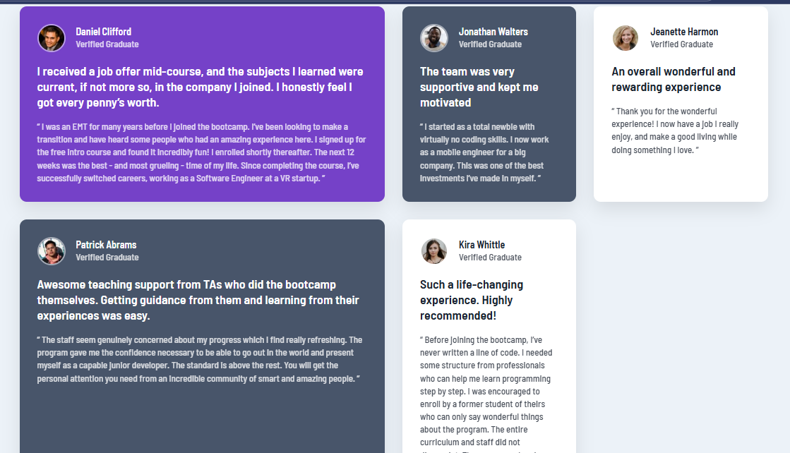

# Testimonials Grid Section

A fully responsive **testimonials grid layout** built with **HTML and CSS**, created as a Frontend Mentor challenge. This project demonstrates modern layout techniques using **CSS Grid**, responsive design, and clean UI structuring.

---

##  Live Demo

Check out the live site here:
https://freedev-group.github.io/Testimonials-grid-section-By-Edouard-/

---

##  Table of Contents

* [Overview](#overview)
* [Features](#features)
* [Technologies](#technologies)
* [Project Structure](#project-structure)
* [Screenshots](#screenshots)
* [Development Process](#development-process)
* [How to Run Locally](#how-to-run-locally)
* [Author](#author)

---

##  Overview

This project is a testimonials grid layout displaying multiple user reviews in a structured and visually appealing format.

It includes:

* Multiple testimonial cards with user information
* A complex layout using CSS Grid
* Clean typography and spacing
* Fully responsive design for all screen sizes

The goal was to replicate the **Frontend Mentor design** as closely as possible while maintaining clean and maintainable code.

---

##  Features

* Fully **responsive design** (desktop, tablet, mobile)
* Modern layout using **CSS Grid**
* Clean and structured testimonial cards
* Consistent spacing and alignment
* Semantic HTML5 for better readability
* Optimized UI for user experience

---

##  Technologies

* **HTML5** – Semantic structure
* **CSS3** – Grid, Flexbox, responsive design

---

##  Project Structure

Testimonials-grid-section/

* index.html # Main HTML file
* style.css # Stylesheet
* images/ # All images (avatars, preview, etc.)

---

##  Screenshots

**Desktop View:**


---

##  Development Process

This project was built following a structured workflow using GitHub issues:

* Project setup and initialization
* HTML structure creation
* CSS Grid layout implementation
* Styling and UI improvements
* Typography and content integration
* Responsive design
* Final review, README update, and deployment

Each step was managed using issues and commits to ensure a clean and professional workflow.

---

##  How to Run Locally

1. Clone the repository:

```bash
git clone https://github.com/FreeDev-Group/Testimonials-grid-section-By-Edouard-.git
```

2. Navigate into the project folder:

```bash
cd Testimonials-grid-section-By-Edouard-
```

3. Open the project:

```bash
open index.html
```

Or simply open `index.html` in your browser.

---

##  Author

* Edouard KIZA NDENGO
* GitHub: https://github.com/edouardkne
* Upwork: *(https://www.upwork.com/freelancers/~0104ed4c9a50a8fe2b?mp_source=share)*

---

##  Acknowledgment

* Inspired by the Testimonials Grid Section challenge on Frontend Mentor:
  https://www.frontendmentor.io/challenges/testimonials-grid-section-Nnw6J7Un7
